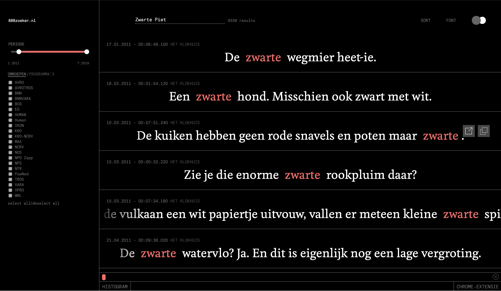

INTODUCTION - What if you could browse the Dutch National Broadcast by what the anchors have said? What if you could do this in a way that optimises the search experience for research instead of entertainment? 888zoeker is an tool that helps researchers explore view this broadcaster through another lens. 

